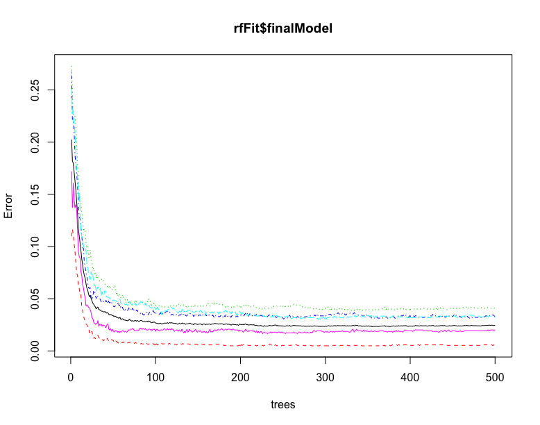
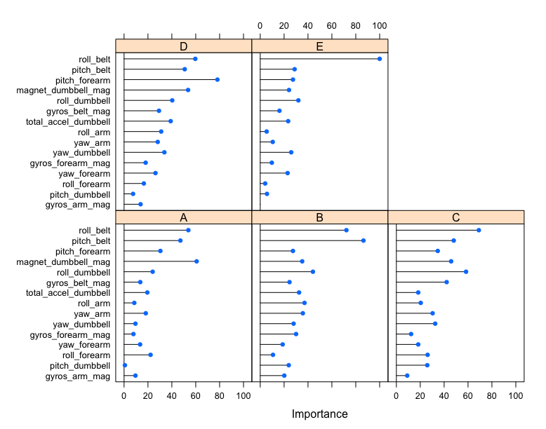

# Exercise Prediction

The goal of this project is to predict the manner in which a group of subjects
did various biceps curl exercises.  There was a given set of data ("training")
containing various sensor readings and some other data.  The assignment was
to use any of these readings to develop a model to predict which exercise
was executed based on the sensor readings.

## Background Information

The following link describes the data set for this project: [project data](http://groupware.les.inf.puc-rio.br/har)

Six young (20-28 years old) male participants were asked to perform a biceps
curl exercise with a lightweight dumbbell in five different ways - one correct
way and four different incorrect ways:  
A) correctly  
B) throwing one's elbows to the front  
C) lifting the dumbbell only halfway  
D) lowering the dumbbell only halfway  
E) throwing one's hips to the front  

The participants performed each of the five types of biceps curls 10 times.
So that is 50 individual lifts for each of the 6 participants, which is 300
individual lifts in total.

The participants wore sensors on their upper arm, lower arm (forearm), and
on a belt they had to wear.  Additionally, there was a sensor on the
dumbbell itself.

## Data

The data for this project are two data sets called "training" and "test".
The "training" data set consists of 19,622 rows of data (observations),
with each row representing a single instance in time during one of the
lifts being executed by one of the participants.

As noted above, there was a grand total of 300 individual lifts.  If there
were one observation for each lift, there would be only 300 rows of data.
Obviously, there must be many data points for each individual lift.
Since some of the lifts differ during only a portion of the lift
(such as the lifting or lowering only halfway), one wonders how it would
be possible to accurately predict differences.

There are a total of 160 pieces of data for each observation (row).

## Data Transformations / Adjustments / Reductions

Since there are so many (160) pieces of data for each observation,
the first challenge is to get rid of data that is likely not going to be
useful in building a model.  From looking at the first row of data in the
training set, I saw a lot of "NA" and "" (empty string / NULL) values.  So
I counted NA and empty string values for the entire training data set.
There is probably a better way to do this, but I used 'sum(is.na(x))'
to find NA values and 'sum(training$x != "")' to find blank / empty
string values.  67 of the 160 columns of data have 19,216 out of
19,622 or 98% values of "NA", so these 67 variables are useless for
predicting.  Additionally, 33 of the 160 columns of data have 98%
empty string / NULL values, so those 33 variables are also useless.
That leaves 160 - (67 + 33) = 60 pieces of data that could be useful.

Of the 60 pieces of data left, one column (the first) is merely an
ordinal count from 1 to 19,622.  And one column (the last) is the
"classe" variable that I am trying to predict.  And one column
(the second) is the subject's name, which does not appear to be useful
for predicting.  That leaves 60 - 3 = 57 pieces of data.  But there are
also 3 timestamp variables and 2 "window" variables - all 5 of which
do not appear useful for predicting.  So that leaves 57 - 5 = 52 variables
to be examined more closely.

There are 12 sets of sensor data with X/Y/Z positions - for example,
'gyros_belt_x', 'gyros_belt_y', and 'gyros_belt_z'.  These can be easily
transformed to a magnitude (a 3-D vector) using 'sqrt(x^2 + y^2 + z^2)'.
So I did that for all 12 sets of X/Y/Z values, which reduces
36 variables down to 12 - a reduction of 24 variables.  So now there
are only 52 - 24 = 28 variables that may be useful in building a model.

28 variables seemed like a more reasonable number.  First I looked to
see whether any of the 28 variables were highly correlated to each other,
as those redundant variables would not be helpful in building a model.
I ran the "cor()" function to create a correlation matrix and then used
the "findCorrelation()" function to find any highly correlated variables.
I found 5 such highly correlated variables.  An example - 'roll_belt',
'accel_belt_mag' (magnitude of accel_belt_x/y/z), and 'total_accel_belt'
were all highly correlated so I kept only one of them and got rid of the
other two.  I was able to get rid of 5 highly correlated variables,
and then I ran the correlation matrix again and found 2 more.
So that left only 28 - 7 = 21 variables that might be useful in building
a predictive model.

## Model Building

21 variables is almost reasonable for training a predictive model.
Since the class lectures recommended random forests and boosting as
the most accurate models in many circumstances, I focused on those two.

I separated the training data into training data and validation data.
Normally the split would be 70% training data and 30% test / validation
data, but I found that with 21 predictors, it took too long for the
random forests model build.  So I changed to 20% training data and
80% test data.  Then the random forests model build took only a few
minutes.  The overall accuracy, based on testing with the 80% test data,
was 96% based on the output of the "confusionMatrix()" function.
I used 3-fold cross-validation for the random forests model build as that
was suggested in one of the class lectures.

Next I decided to eliminate the least important 6 of the 21 variables,
according to the "varImp()" function call with the random forests model
fit as the input.  Using only 15 predictors, I changed to 40% training
data and 60% validation data.  The random forests model build then took
5 minutes and the accuracy improved to 98%.

I then decided to eliminate the least important 5 of the remaining
15 predictors.  Using only 10 predictors, I changed to 70% training
data and 30% validation data (the usual split).  The random forests
model build took 8 minutes but the accuracy was only 96%, so I went
back to the 15 predictors model.

I then tried running the boosting (gbm) model fit with the 15 predictors
from above and found that the default values did not work.  I found
information about caret model training and tuning at this web page:
[caret model training and tuning](http://topepo.github.io/caret/model-training-and-tuning.html)
I was able to use that information to get a boosting model build to work,
but the accuracy was only 94%, so I went back to the random forests
model.

### Features / Variables / Parameters Used in the Model

As noted in the previous section, I settled on a model that uses
15 predictors.  Here is a list of those 15 predictors (not in any
particular order):

1) roll_belt  
2) pitch_belt  
3) gyros_belt_mag(nitude)  
4) roll_arm  
5) yaw_arm  
6) gyros_arm_mag(nitude)  
7) roll_dumbbell    
8) pitch_dumbbell   
9) yaw_dumbbell   
10) total_accel_dumbbell  
11) magnet_dumbbell_mag(nitude)  
12) roll_forearm  
13) pitch_forearm  
14) yaw_forearm  
15) gyros_forearm_mag(nitude)  

Note that the 4 "xxx_magnitude" variables above were created by transforming
the corresponding X/Y/Z raw data (for example, gyros_belt_x, gyros_belt_y,
and gyros_belt_z) to a magnitude (3-D vector) as noted earlier using the
formula 'sqrt(x^2 + y^2 + z^2)'.

## Accuracy / Errors

The expected out-of-sample error should match the accuracy value from
the test with the validation data because I did not use that validation
data to train the model.  So the out-of-sample error should be roughly 2%.

Here is the output from the "confusionMatrix()" function using the final
prediction model described above run on the 60% validation data:

```{r, echo=TRUE}

#Confusion Matrix and Statistics

#          Reference
#Prediction    A    B    C    D    E
#         A 3332   44    2    5    2
#         B    5 2194   43    3   13
#         C    7   31 1976   54   14
#         D    1    5   32 1867   11
#         E    3    4    0    0 2124

#Overall Statistics
                                         
#               Accuracy : 0.9763         
#                 95% CI : (0.9734, 0.979)
#    No Information Rate : 0.2844         
#    P-Value [Acc > NIR] : < 2.2e-16      
                                         
#                  Kappa : 0.97           
# Mcnemar's Test P-Value : 5.889e-12      

#Statistics by Class:

#                     Class: A Class: B Class: C Class: D Class: E
#Sensitivity            0.9952   0.9631   0.9625   0.9679   0.9815
#Specificity            0.9937   0.9933   0.9891   0.9950   0.9993
#Pos Pred Value         0.9843   0.9717   0.9491   0.9744   0.9967
#Neg Pred Value         0.9981   0.9912   0.9921   0.9937   0.9959
#Prevalence             0.2844   0.1935   0.1744   0.1639   0.1838
#Detection Rate         0.2830   0.1864   0.1679   0.1586   0.1804
#Detection Prevalence   0.2875   0.1918   0.1769   0.1628   0.1810
#Balanced Accuracy      0.9945   0.9782   0.9758   0.9814   0.9904
```

Here is a plot of the final model:  


And here is a plot of the varImp variable importance for the final model:

